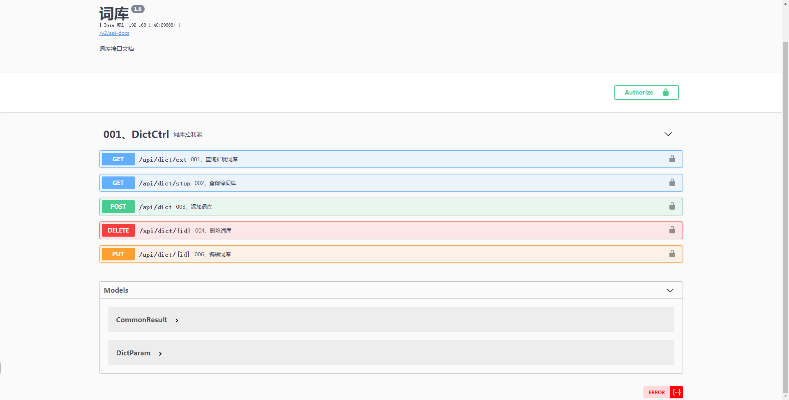

# elasticsearch ik 扩展词库远程词库接口

### 扩展词库
    URL:   /api/dict/ext
### 停词库
     URL:   /api/dict/stop

### API 文档地址
      URL:   /docs/index.html 
### API 文档截图      


``` lua
esik
├── doc/es.sql  -- 数据脚本
├── com.gl.mbg -- MyBatisGenerator生成的数据库操作代码
├── com.gl.common --  公用代码
└── com.gl.es -- 接口API

```     
 
### 技术选型
 
 
 技术 | 说明 | 官网
 ----|----|----
 Spring Boot | 容器+MVC框架 | [https://spring.io/projects/spring-boot](https://spring.io/projects/spring-boot)
 MyBatis | ORM框架  | [http://www.mybatis.org/mybatis-3/zh/index.html](http://www.mybatis.org/mybatis-3/zh/index.html)
 MyBatisGenerator | 数据层代码生成 | [http://www.mybatis.org/generator/index.html](http://www.mybatis.org/generator/index.html)
 PageHelper | MyBatis物理分页插件 | [http://git.oschina.net/free/Mybatis_PageHelper](http://git.oschina.net/free/Mybatis_PageHelper)
 Swagger-UI | 文档生产工具 | [https://github.com/swagger-api/swagger-ui](https://github.com/swagger-api/swagger-ui)
 Hibernator-Validator | 验证框架 | [http://hibernate.org/validator/](http://hibernate.org/validator/)
 Elasticsearch | 搜索引擎 | [https://github.com/elastic/elasticsearch](https://github.com/elastic/elasticsearch)
 Redis | 分布式缓存 | [https://redis.io/](https://redis.io/)
 Druid | 数据库连接池 | [https://github.com/alibaba/druid](https://github.com/alibaba/druid)
 Lombok | 简化对象封装工具 | [https://github.com/rzwitserloot/lombok](https://github.com/rzwitserloot/lombok)

 
###  开发工具
 
 工具 | 说明 | 官网
 ----|----|----
 IDEA | 开发IDE | https://www.jetbrains.com/idea/download
 RedisDesktop | redis客户端连接工具 | https://redisdesktop.com/download
 SwitchHosts| 本地host管理 | https://oldj.github.io/SwitchHosts/
 X-shell | Linux远程连接工具 | http://www.netsarang.com/download/software.html
 Navicat | 数据库连接工具 | http://www.formysql.com/xiazai.html
 PowerDesigner | 数据库设计工具 | http://powerdesigner.de/
 
### 开发环境
 
 工具 | 版本号 | 下载
 ----|----|----
 JDK | 1.8 | https://www.oracle.com/technetwork/java/javase/downloads/jdk8-downloads-2133151.html
 Mysql | 5.7 | https://www.mysql.com/
 Redis | 3.2 | https://redis.io/download
 Elasticsearch | 6.2.2 | https://www.elastic.co/downloads
 nginx | 1.10 | http://nginx.org/en/download.html
 
 ## 参考资料
 
 - [Spring实战（第4版）](https://book.douban.com/subject/26767354/)
 - [Spring Boot实战](https://book.douban.com/subject/26857423/)
 - [Spring Data实战](https://book.douban.com/subject/25975186/)
 - [MyBatis从入门到精通](https://book.douban.com/subject/27074809/)
 - [深入浅出MySQL](https://book.douban.com/subject/25817684/)
 - [循序渐进Linux（第2版）](https://book.douban.com/subject/26758194/)
 - [Elasticsearch 权威指南](https://www.elastic.co/guide/cn/elasticsearch/guide/current/index.html)
 - [Elasticsearch 技术解析与实战](https://book.douban.com/subject/26967826/)
 - [MongoDB实战(第二版)](https://book.douban.com/subject/27061123/)
 - [Kubernetes权威指南](https://book.douban.com/subject/26902153/)
 - [Pro Git](https://git-scm.com/book/zh/v2)    